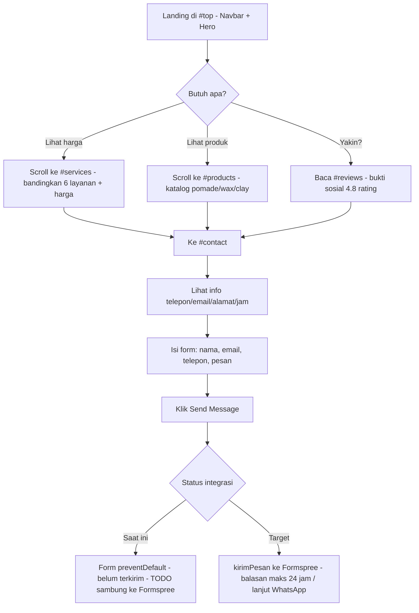

# User Flow — SiBarber Company Profile

Penulis: Arga (UI/UX & Dokumentasi).
Sumber implementasi: `app/page.js`, `components/nav-links.js`, `components/contact-form.js`, `lib/formspree.js`.
Desain acuan: https://www.figma.com/design/O0ShMf9L8F7ojARyujcjqS/SiBarber-UI-UX?node-id=0-1&t=TjJ06M1JGWRwFz7B-1

## Persona

1. **Pengunjung baru** — ingin tahu harga potong rambut, jam buka, dan lokasi secepat mungkin.
2. **Calon pelanggan booking** — sudah cocok dengan gaya di galeri/review, ingin menghubungi barbershop.
3. **Pembeli produk** — melihat katalog pomade/wax/clay lalu bertanya via kontak.

Aplikasi ini adalah **one-page landing**, jadi tidak ada login. Semua alur terjadi dalam satu halaman scroll.

## Peta navigasi (implementasi)

`app/page.js` menyusun section berurutan:

```
Navbar (sticky) → Hero (#top) → About (#about) → Services (#services)
→ Products (#products) → Reviews → Contact (#contact) → Footer
```

`components/nav-links.js` memetakan label ke anchor:

| Label Navbar | Anchor | Catatan |
| :--- | :--- | :--- |
| Home | `#top` | status aktif = tidak ada hash |
| About Us | `#about` | tracking via `hashchange` |
| Services | `#services` | daftar harga |
| Products | `#products` | katalog grooming |
| Locations | `#contact` | label "Locations" tetapi mengarah ke section kontak (perlu diputuskan: ganti label jadi "Contact" atau buat section lokasi sendiri) |

Status aktif dihitung di `NavLinks()` (`useState` + listener `hashchange`), dengan gaya pill putih untuk link aktif.

## Diagram alur utama



## Sub-flow 1: pengunjung baru (3 klik sampai harga)

1. Buka `/` → Hero menampilkan headline "Elevate your style, Define your look" + badge rating.
2. Klik **Services** di navbar (atau scroll 1 layar).
3. Baca kartu layanan (`components/services.js`: 6 paket, harga 50–130) → klik **Contact Us** (`href="#contact"` di `navbar.js`).

Kriteria diterima: harga terbaca di desktop 1440px tanpa scroll horizontal; anchor tidak tertutup navbar (sudah ada `scroll-padding-top: 96px` di `globals.css`). Scope desktop-only sesuai wireframe Figma.

## Sub-flow 2: calon booking via kontak

1. Di `#contact`, baca panel kiri (telepon/email/alamat/jam + peta).
2. Di panel kanan isi `first-name`, `last-name`, `email`, `phone`, `message` (`contact-form.js`).
3. Klik **Send Message**.

Kondisi saat ini (wajib disampaikan saat demo):

- `contact-form.js:onSubmit` memanggil `event.preventDefault()` saja — pesan **belum terkirim ke mana pun**.
- Helper `kirimPesan()` di `lib/formspree.js` sudah siap (POST JSON ke `https://formspree.io/f/mgvgzgw`) tetapi **belum dipanggil** dari form. Ini TODO frontend + backend sebelum rilis.
- Rencana WhatsApp booking belum ada kode (`wa.me` tidak ditemukan di repo) — alur target: setelah form sukses, tampilkan tombol "Lanjut via WhatsApp" dengan teks terisi otomatis.

## Layar & aksesibilitas (desktop-only)

- Target: desktop 1440px sesuai frame Figma. Kelas breakpoint (`sm:`, `lg:`) di kode menjaga layout tidak pecah, tetapi tidak diuji di mobile.
- `scroll-behavior: smooth` + `prefers-reduced-motion` sudah ditangani di `globals.css`.
- Semua link CTA punya `focus-visible:ring` — QA perlu uji navigasi keyboard.

## Yang perlu diputuskan tim

1. Label navbar **"Locations"** vs section `#contact` — ganti label atau tambah section lokasi/peta beneran?
2. Satu sumber kebenaran kontak: `data/profile.js` vs `components/contact.js` (beda negara/format).
3. Validasi form: field wajib, format email/telepon Indonesia, dan pesan error/sukses setelah Formspree disambungkan.
