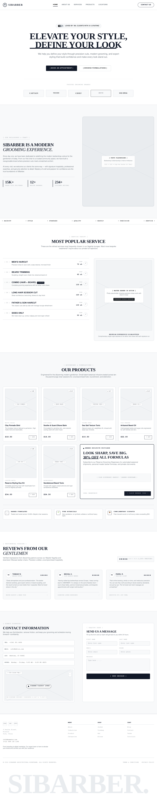
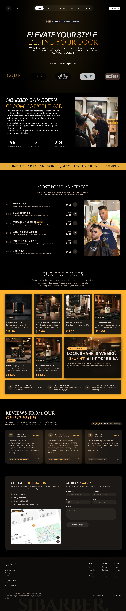

# Wireframe & Design System — SiBarber

Penulis: Arga (UI/UX & Dokumentasi).
File Figma (sumber kebenaran desain): https://www.figma.com/design/O0ShMf9L8F7ojARyujcjqS/SiBarber-UI-UX?node-id=0-1&t=TjJ06M1JGWRwFz7B-1
Implementasi: `components/*.js`, `app/globals.css`, `app/page.js`.

## Cara membaca dokumen ini

- Desain memakai **1 frame Figma desktop** berisi seluruh landing page berurutan (company profile satu halaman).
- **Wireframe (Figma)** = struktur/alur di frame tersebut; **hasil (kode)** = implementasi Tailwind di repo ini.
- Aset tersimpan di `docs/assets/`: `wireframe-landing-desktop.png` (dari Figma) dan `hasil-landing-desktop.png` (screenshot web desktop).

### Wireframe — 1 frame landing desktop (Figma)

### Hasil implementasi — landing desktop (web)

## Peta area frame → section kode

| # | Area di frame tunggal | Section kode | Tujuan & CTA |
| :--- | :--- | :--- | :--- |
| 1 | Navbar + Hero | `navbar.js`, `nav-links.js`, `hero.js` (`#top`) | Kesan pertama: badge rating, headline, CTA. CTA: nav anchor + `Contact Us → #contact`. |
| 2 | About | `about.js` (`#about`) | Kepercayaan: statistik 15K/12/234 + pita layanan. Tanpa CTA, jembatan ke Services. |
| 3 | Services | `services.js` (`#services`) | Keputusan harga: 6 paket + badge signature. CTA: lanjut ke kontak. |
| 4 | Products | `products.js` (`#products`) | Katalog grooming + promo. CTA: tanya via kontak. |
| 5 | Reviews | `reviews.js` | Bukti sosial sebelum konversi. Tanpa form. |
| 6 | Contact + Footer | `contact.js`, `contact-form.js` (`#contact`), `footer.js` | Konversi: info + peta + form pesan; footer menu/sosial. CTA: `Send Message`. |

## Anotasi per section (ringkas)

1. **Navbar**: sticky, 3 kolom (logo kiri, pill nav tengah, CTA kanan). Target desktop: pill nav tampil penuh (`lg:block`); tampilan di bawah itu di luar scope (desktop-only).
2. **Hero**: badge avatar + rating, H1 dua baris (italic display + gold), marquee mikro, grid brand 2→3→5 kolom.
3. **About**: grid 1 kolom → `lg:2 kolom`, H2 italic uppercase dengan underline biru.
4. **Services**: daftar bernomor 01–06 dengan harga, 1 kartu signature ditonjolkan.
5. **Products**: grid kartu gambar + harga + deskripsi (gambar Unsplash, perlu fallback).
6. **Contact**: kartu `rounded-3xl` 2 kolom (`lg:`), kiri info + peta placeholder, kanan form 2 kolom (`sm:`) + textarea + tombol.

## Design token (dari kode)

| Token | Nilai | Pakai di |
| :--- | :--- | :--- |
| Background | `#0a0a0a` / `bg-zinc-950` | halaman, navbar `zinc-950/70` |
| Aksen emas | `#f5a623` (`text-gold`), lembut `#f0c24b` | harga, ikon, sorotan |
| Teks | `#ededed`, `zinc-300/400/500` | body, deskripsi, placeholder |
| Font headline | Geist italic (`font-display`) | hero H1 |
| Font judul section | Playfair (`font-serif`, small-caps) | About/Contact H2/H3 |
| Radius | `rounded-full` (pill/CTA), `rounded-3xl` (kartu kontak), `rounded-xl` (peta) | nav, tombol, kartu |
| Border | `border-white/10` | kartu, pill nav |
| Scroll | `smooth` + `scroll-padding-top: 96px`, hormati `prefers-reduced-motion` | anchor di bawah sticky header |

## Target layar (desktop-only)

- Scope disepakati: **desktop 1440px**. Frame Figma dan screenshot sama-sama desktop.
- Kode memakai kelas breakpoint (`sm:`, `lg:`) sehingga layout tidak pecah saat jendela diperkecil, tetapi QA hanya menguji di desktop.
- Uji wajib: buka `http://localhost:3000` di 1440px, pastikan tidak ada scroll horizontal dan anchor tidak tertutup navbar sticky.

## Status aset (sudah terisi)

| File di `docs/assets/` | Sumber | Status |
| :--- | :--- | :--- |
| `wireframe-landing-desktop.png` | Export 1 frame Figma `SiBarber-UI-UX` (desktop, PNG) | Sudah ada |
| `hasil-landing-desktop.png` | Screenshot `npm run dev` → `http://localhost:3000` (desktop 1440px, full page) | Sudah ada |

> Jika frame Figma direvisi, ekspor ulang dengan nama file yang sama lalu commit `docs: perbarui aset wireframe SiBarber`.

## Status implementasi vs desain

| Section | Status | Selisih yang diketahui |
| :--- | :--- | :--- |
| Navbar/Hero | Sudah | CTA `Contact Us` sudah benar ke `#contact`. |
| About/Services/Products/Reviews | Sudah | Harga services di kode (50–130) beda skala dengan `data/services.js` (ribuan) — samakan sebelum rilis. |
| Contact form | Sebagian | Tampilan sudah, pengiriman belum (lihat `USER-FLOW.md` + `TECHNICAL.md` §6). |
| Footer | Sebagian | Link `Industries/Categories/Jacket/...` dan sosial masih `href="#"` placeholder. |
| Peta lokasi | Placeholder | Kotak `Map location` + badge `View larger map` — ganti embed peta asli atau hapus sebelum demo. |
